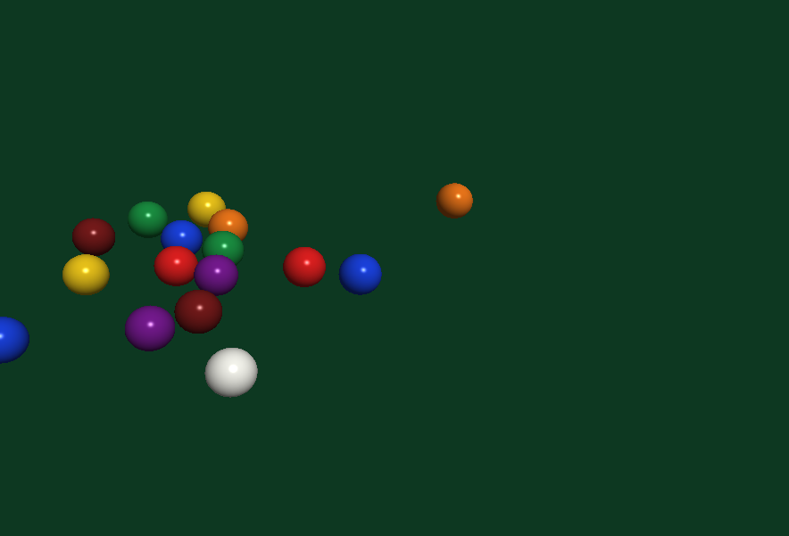

# LDP3-OpenGL

A pluggable LDP3 library that binds OpenGL through the language's `extern` FFI — no new compiler
support, just LDP3 talking to `opengl32`, `gdi32`, and `user32`. It lives in-tree under `libs/opengl/`
while it takes shape; the intent is to extract it to its own repository once the shape is proven
(per the graphics plan: graphics are *pluggable libraries*, not core language).

## Status

Slices 1 and 2 done. A colored triangle is rendered offscreen from LDP3 and spun across angles,
each frame written to a PPM. Below is the 45° frame (`triangle.ldp3`), rendered headlessly through
the GDI generic software renderer:



There is also a **visible, live-animated** version, `triangle_window.ldp3`, that opens a real titled
window and spins the triangle continuously (close the window to quit). It reuses the built-in
"STATIC" window class — so still no `RegisterClass`/`WNDPROC` — pumps messages each frame to stay
responsive, detects the close button via `IsWindow`, and presents with `SwapBuffers`. It needs a
display session; on a machine with a GPU it is hardware-accelerated.

```
ldp3c triangle_window.ldp3 -o tw.ll
clang tw.ll ldp3_rt.lib -lopengl32 -lgdi32 -luser32 -lkernel32 -o triangle_window.exe
triangle_window.exe        # a window opens with the spinning triangle; close it to quit
```

## The plan (slices)

1. **Offscreen context probe** *(current)* — stand up a hidden-window OpenGL context and read back
   `GL_VERSION` / `GL_RENDERER`, entirely from LDP3 via FFI. This validates the whole risky path at
   once: `extern` calls into the Win32 + WGL + GL DLLs, the Win32 struct layouts (`PIXELFORMATDESCRIPTOR`,
   the window class), a capture-free lambda used as the `WNDPROC` callback, and creating a GL context
   with no visible window.
2. **Spinning triangle → PPM** — a colored triangle rotated by an angle, rendered to the context's
   framebuffer, read back with `glReadPixels`, and written to a PPM image (one file per angle). Because
   the image is written to disk, the render can be validated headlessly (no display needed) — the whole
   point of the offscreen approach.
3. **A small OO surface** — wrap the raw FFI in LDP3 classes (`GlContext`, `Shader`, `Mesh`, …) so the
   bindings feel like a library, not a pile of `extern`s.
4. **Modern GL** — shaders, VAO/VBO, FBOs. This needs a real GPU driver (an ICD exposing OpenGL 3.3+);
   the software fallback used for headless CI is the GDI generic renderer, which is **OpenGL 1.1 only**.
   So slices 1–2 deliberately stay on fixed-function GL 1.1 so they run and render anywhere, including
   headless. Slice 4 is a follow-up for a machine with a GPU.

## Rendering model (headless-friendly)

OpenGL on Windows always needs a device context with a pixel format before a GL context can be made
current. We use a **hidden window** for that DC. Rendering targets the window's back buffer; the frame
is captured with `glReadPixels` into a byte buffer and written out as a binary PPM (`P6`), which any
image viewer — and this toolchain — can open. Nothing is ever shown on screen.

## Build

```
ldp3 build            # uses ldp3.toml (native_libs = opengl32, gdi32, user32)
# or, by hand:
ldp3c probe.ldp3 -o probe.ll
clang probe.ll ldp3_rt.lib -lopengl32 -lgdi32 -luser32 -o probe.exe
```
